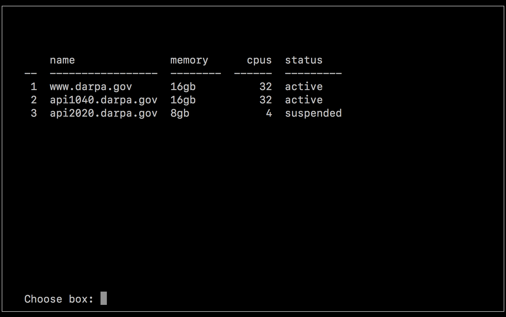
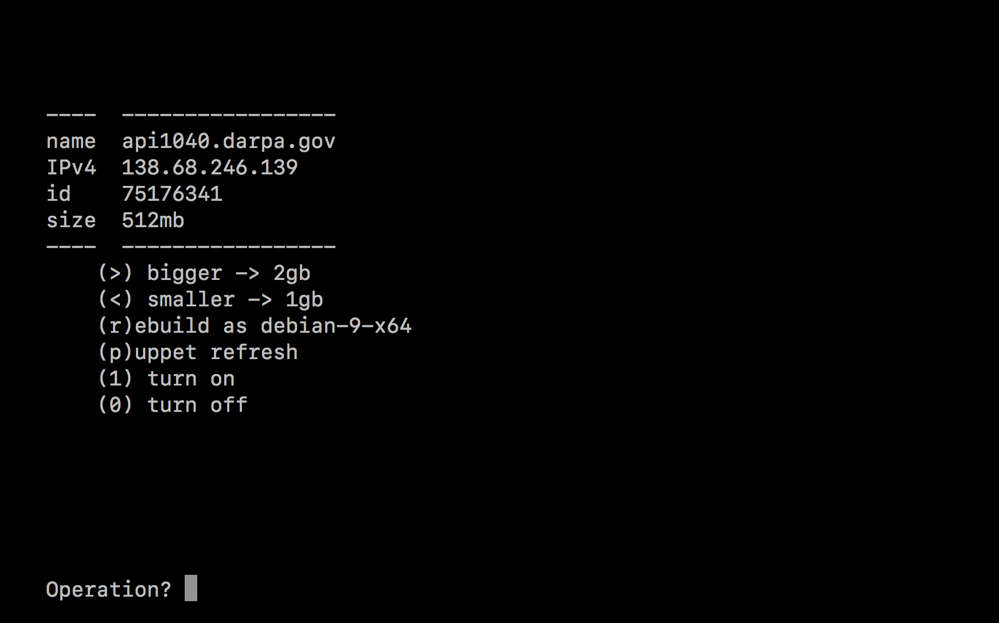

Text-mode interface for provisioning cloud nodes.

WARNING: Pre-alpha, I don't recommend using this yourself.

Installation (development)
=====
  pip install -e .

Configuration
=====
  sudo cp config.yaml.example /etc/boxes.yaml

Set the `api_token` to your DigitalOcean access token.

Usage
=====
  boxes

TODO
=====
* Parse and pretty-print all responses.
* Progress/wait popup, or async operations.  Queue operations and confirm
execution.
* Full log window and write to log file.
* Customization hooks for stuff like `refresh_puppet.sh`
* Rebuild and resize are pending merge of https://github.com/apache/libcloud/pull/1169
